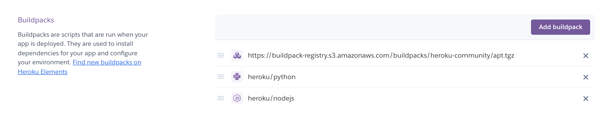
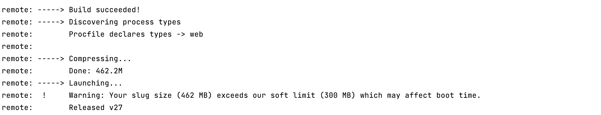

## The Noise Enricher

### It's the opposite of noise cancellation!

#

## HEROKU deployment

For this project, it was decided for the sake of simplicity and convenience to keep AI-related processing in the same
app container (“Dyno”) on the Heroku server. The main benefit of this approach is that the audio files uploaded by the
user and generated by the AI algorithms are immediately accessible for both AI and frontend since these files are on the
same server. Heroku allows us to do that using several [buildpacks](https://devcenter.heroku.com/articles/buildpacks) in
the same application. Here is the list of all buildpacks that we used:



First major part of our setup is the `heroku/nodejs` buildpack that is responsible for the Node.js server. It uses
the [`package.json`](package.json) file in the root of the GitHub repository. This file includes commands to build and
start the express server from the `node_app/server` folder:

```json
"scripts": {
"heroku-prebuild": "cd node_app/server && npm install && npm run build",
"start": "cd node_app/server && npm start"
}
```

The second main component of our setup is the `heroku/python` buildpack that is responsible for the python environment.
It requires [`requirements.txt`](requirements.txt) and [`runtime.txt`](runtime.txt) files in the root of the GitHub
repository. Although Heroku allows to install any pipinstallable python package, there is an important limitation that
is the “Slug size” which amounts to 500MB. See more
information [here]( https://devcenter.heroku.com/articles/slug-compiler#:~:text=gitignore%20file.-,Slug%20size,such%20as%20ls%20and%20du%20.)
. One can significantly reduce the slug size for `Pytorch` library
using [this method]( https://stackoverflow.com/questions/59122308/heroku-slug-size-too-large-after-installing-pytorch)
and [this method]( https://stackoverflow.com/questions/65677710/tensorflow-apps-no-longer-deploying-to-heroku-slug-size-too-large)
for `TensorFlow`. There are also
general [recommendations on Heroku]( https://devcenter.heroku.com/articles/slug-compiler#:~:text=gitignore%20file.-,Slug%20size,such%20as%20ls%20and%20du%20.)
how to decrease the slug size. But both main machine learning libraries (` Pytorch` and `TensorFlow`) cannot be deployed
in the same web application on Heroku. The final set of the installed python packages is the following:

```
tensorflow-cpu==2.7.0
librosa==0.8.1
AudioSegment==0.23.0
pydub==0.25.1
h5py==2.10.0
pysoundfile==0.9.0
```

Additionally, to run python package [`SoundFile`]( https://pypi.org/project/SoundFile/) correctly we
installed [` heroku/heroku-buildpack-apt`](https://github.com/heroku/heroku-buildpack-apt). One can find more
information about the error and the
solution [here]( https://stackoverflow.com/questions/57743005/how-to-use-soundfile-on-heroku). This buildpack needs
the `Aptfile` in the root of the GitHub repository which has the following content:

```
libsndfile1
libsndfile1-dev
```

After setting up all the configuration files, one can simply follow the description of
the [git-based deployment process](https://devcenter.heroku.com/articles/git). After this on can simply push `develop`
branch to Heroku `main` brand:

```bash
git push heroku develop:main
```

Here is how the successful build and deployment looks like from the Heroku CLI:

